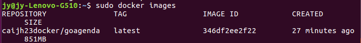
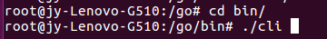
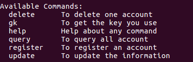
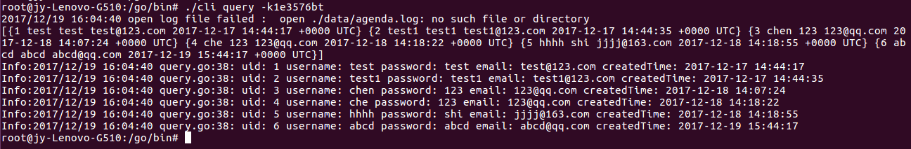
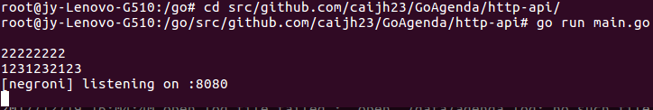

# GoAgenda
[](https://travis-ci.org/caijh23/GoAgenda) </br>
微服务agenda

## 目录说明
http-api即为课程要求的service目录

## 使用说明
- 安装
```
sudo docker pull caijh23docker/goagenda
```
查看镜像 </br>
 

- 运行镜像
```
sudo docker run -p 3306:3306 --name agenda -d caiji23docker/goagenda
```
- 开一个进程
```
sudo docker run -it --net host caijh23docker/goagenda
```
- 客户端命令行使用
如图所示进入bin,运行./cli </br>
 </br>
其中这部分是可调用的命令 </br>
 </br>
运行客户端命令例子 </br>
 </br>
- 启动服务端
如图所示进入对应目录,运行main.go </br>
 </br>

## 系统测试结果
```
ab -n 1000 -c 100 "http://localhost:8080/v1/user/getkey?username=root&password=pass"
This is ApacheBench, Version 2.3 <$Revision: 1706008 $>
Copyright 1996 Adam Twiss, Zeus Technology Ltd, http://www.zeustech.net/
Licensed to The Apache Software Foundation, http://www.apache.org/

Benchmarking localhost (be patient)
Completed 100 requests
Completed 200 requests
Completed 300 requests
Completed 400 requests
Completed 500 requests
Completed 600 requests
Completed 700 requests
Completed 800 requests
Completed 900 requests
Completed 1000 requests
Finished 1000 requests


Server Software:        
Server Hostname:        localhost
Server Port:            8080

Document Path:          /v1/user/getkey?username=root&password=pass
Document Length:        72 bytes

Concurrency Level:      100
Time taken for tests:   0.080 seconds
Complete requests:      1000
Failed requests:        0
Total transferred:      195000 bytes
HTML transferred:       72000 bytes
Requests per second:    12482.84 [#/sec] (mean)
Time per request:       8.011 [ms] (mean)
Time per request:       0.080 [ms] (mean, across all concurrent requests)
Transfer rate:          2377.10 [Kbytes/sec] received

Connection Times (ms)
              min  mean[+/-sd] median   max
Connect:        0    1   0.7      1       4
Processing:     1    6   3.7      5      20
Waiting:        0    6   3.5      5      18
Total:          1    8   3.6      6      21

Percentage of the requests served within a certain time (ms)
  50%      6
  66%      8
  75%     10
  80%     11
  90%     13
  95%     15
  98%     16
  99%     16
 100%     21 (longest request)
```