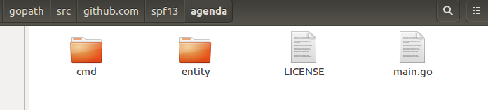
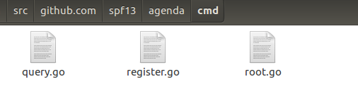
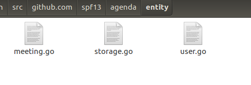
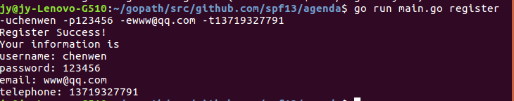
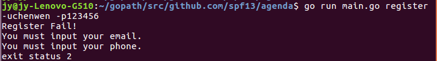
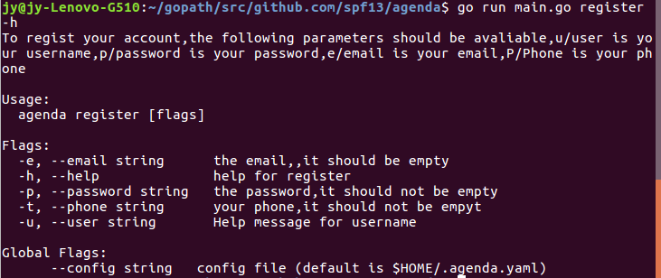
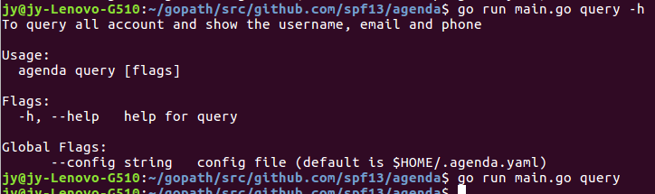

[TOC]
####CLI 命令行实用程序开发实战 - Agenda
##### 说明：目前数据持久化由于遇到json不能转小写成员，在利用反射转的过程bug还未解决故部分代码注释了
##### 1.按 3.3 安装 cobra 并完成小案例
安装 :
1.使用命令 go get -v github.com/spf13/cobra/cobra 
下载过程中，会出提示如下错误
Fetching https://golang.org/x/sys/unix?go-get=1
https fetch failed: Get https://golang.org/x/sys/unix?go-get=1: dial tcp 216.239.37.1:443: i/o timeout
在 \$GOPATH/src/golang.org/x 目录下用 git clone 下载 sys 和 text 项目
2.使用 go install github.com/spf13/cobra/cobra, 安装后在 $GOBIN 下出现了 cobra 可执行程序
完成小案例:
创建一个处理命令 agenda register -uTestUser 或 agenda register --user=TestUser 的小程序。
1.使用命令
cobra init 文件目录
cobra add register
这样在init后的文件目录中就会产生所需文件
2.修改register.go,在init()中添加
registerCmd.Flags().StringP("user", "u", "Anonymous", "Help message for username")
3.在run匿名回调函数中添加
username, _ := cmd.Flags().GetString("user")
fmt.Println("register called by " + username)
4.测试命令
运行该命令
\$ go run main.go register --user=TestUser
运行完就会出现
register called by TestUser
这是因为在匿名回调函数中输出了user的值
这里给一个我们修改后的截图

##### 2.按需求设计 agenda 的命令与参数
详见cmd-design.md
#####3.master 创建项目，提交到 github， 其他人 fork 该项目
如图所示:



#####4.每人分别创建属于自己的命令（命令实现 Print 读取的参数即可），提交并归并。确保不同人管理不同文件，以便于协作
在讲命令前,先介绍一下我们的user,meeting还有storage
1.user
```
package entity
//user的结构体
type User struct {
	username string
	password string
	email    string
	phone    string
}
//赋值
func (u *User) SetUsername(s string) {
	u.username = s
}
func (u *User) SetPassword(s string) {
	u.password = s
}
func (u *User) SetEmail(s string) {
	u.email = s
}
func (u *User) SetPhone(s string) {
	u.phone = s
}
func (u *User) SetUser(username, password, email, phone string) {
	u.username = username
	u.password = password
	u.email = email
	u.phone = phone
}
//获取值
func (u User) GetUsername() string {
	return u.username
}
func (u User) GetPassword() string {
	return u.password
}
func (u User) GetEmail() string {
	return u.email
}
func (u User) GetPhone() string {
	return u.phone
}
func (u User) GetUser() (string, string, string, string) {
	return u.username, u.password, u.email, u.phone
}

```
2.meeting
跟user差不多,就是赋值和获取值的函数
```
package entity

import (
	"time"
)

type Meeting struct {
	m_sponsor       string
	m_participators []string
	m_startDate     time.Time
	m_endDate       time.Time
	m_title         string
}

func (m *Meeting) IsParticipator(t_username string) bool {
	for _, value := range m.m_participators {
		if value == t_username {
			return true
		}
	}
	return false
}
func (m *Meeting) SetSponsor(t_sponsor string) {
	m.m_sponsor = t_sponsor
}
func (m Meeting) GetSponsor() string {
	return m.m_sponsor
}
func (m Meeting) GetParticipator() []string {
	return m.m_participators
}
func (m *Meeting) SetParticipator(t_participators []string) {
	m.m_participators = t_participators
}
func (m Meeting) GetStartDate() time.Time {
	return m.m_startDate
}
func (m *Meeting) SetStartDate(t_startDate time.Time) {
	m.m_startDate = t_startDate
}
func (m Meeting) GetEndDate() time.Time {
	return m.m_endDate
}
func (m *Meeting) SetEndDate(t_endDate time.Time) {
	m.m_endDate = t_endDate
}
func (m Meeting) GetTittle() string {
	return m.m_title
}
func (m *Meeting) SetTittle(t_tittle string) {
	m.m_title = t_tittle
}

```
3.Storage
详见storage.go
目前就实现了两条命令
1.Agenda register -uusername -ppassword -eemail -ttelephone -h
代码如图所示
```
// Copyright © 2017 NAME HERE <EMAIL ADDRESS>
//
// Licensed under the Apache License, Version 2.0 (the "License");
// you may not use this file except in compliance with the License.
// You may obtain a copy of the License at
//
//     http://www.apache.org/licenses/LICENSE-2.0
//
// Unless required by applicable law or agreed to in writing, software
// distributed under the License is distributed on an "AS IS" BASIS,
// WITHOUT WARRANTIES OR CONDITIONS OF ANY KIND, either express or implied.
// See the License for the specific language governing permissions and
// limitations under the License.

package cmd

import (
	"fmt"

	"github.com/spf13/agenda/entity"
	"github.com/spf13/cobra"
	"os"
)

// registerCmd represents the register command
var registerCmd = &cobra.Command{
	Use:   "register",
	Short: "To register an account",
	Long:  `To regist your account,the following parameters should be avaliable,u/user is your username,p/password is your password,e/email is your email,P/Phone is your phone`,
	Run: func(cmd *cobra.Command, args []string) {
		//获取各个参数
		username, err1 := cmd.Flags().GetString("user")
		password, err2 := cmd.Flags().GetString("password")
		email, err3 := cmd.Flags().GetString("email")
		phone, err4 := cmd.Flags().GetString("phone")
		tempErr := []error{err1, err2, err3, err4}
		isempty := outPutErr(tempErr)
		//判断是否出错,若出错,打印错误信息,结束进程
		if !isempty {
			fmt.Println("Register Fail!")
			os.Exit(1)
		}
		//判断是否有空值,即没有输入姓名密码邮箱电话中的任意一个
		ifNull(username, password, email, phone)
		//判断用户是否已经存在
		ifExist(username)
		//创建用户并存到Storage中
		var tempUser entity.User
		tempUser.SetUser(username, password, email, phone)
		s := &entity.Storage
		s.CreatUser(tempUser)
		//输出创建成功信息
		fmt.Println("Register Success!")
		fmt.Println("Your information is\nusername: " + username + "\npassword: " + password + "\nemail: " + email + "\ntelephone: " + phone)
	},
}
//获取所有用户的过滤函数
func getAll(u entity.User) bool { return true }
//更新用户信息的函数
func switcher(u *entity.User) { u.SetPassword("l") }

func ifNull(u string, p string, e string, t string) {
	i := 0
	err := ""
	if u == "" {
		err += "\nYou must input your name."
		i += 1
	}
	if p == "" {
		err += "\nYou must input your phone."
		i += 1
	}
	if e == "" {
		err += "\nYou must input your email."
		i += 1
	}
	if t == "" {
		err += "\nYou must input your phone."
		i += 1
	}
	//若有空值,输出错误信息,结束进程
	if i != 0 {
		fmt.Println("Register Fail!" + err)
		os.Exit(2)
	}
}

func ifExist(u string) {
	s := &entity.Storage
	userList := s.QueryUser(getAll)
	for _, v := range userList {
		if (&v).GetUsername() == u {
			//若用户存在,输出错误信息,结束进程
			fmt.Println("Register Fail!")
			fmt.Println("Your name " + u + " is already exist.")
			os.Exit(3)
		}
	}
}
//输出err
func outPutErr(errs []error) bool {
	for _, value := range errs {
		if value != nil {
			fmt.Println(value)
			return false
		}
	}
	return true
}

func init() {
	RootCmd.AddCommand(registerCmd)
	//设置各个参数
	registerCmd.Flags().StringP("user", "u", "", "Help message for username")
	registerCmd.Flags().StringP("password", "p", "", "the password,it should not be empty")
	registerCmd.Flags().StringP("email", "e", "", "the email,,it should be empty")
	registerCmd.Flags().StringP("phone", "t", "", "your phone,it should not be empyt")
	// Here you will define your flags and configuration settings.

	// Cobra supports Persistent Flags which will work for this command
	// and all subcommands, e.g.:
	// registerCmd.PersistentFlags().String("foo", "", "A help for foo")

	// Cobra supports local flags which will only run when this command
	// is called directly, e.g.:
	// registerCmd.Flags().BoolP("toggle", "t", false, "Help message for toggle")
}

```
运行结果



2.Agenda query -h
代码如图所示
```
// Copyright © 2017 NAME HERE <EMAIL ADDRESS>
//
// Licensed under the Apache License, Version 2.0 (the "License");
// you may not use this file except in compliance with the License.
// You may obtain a copy of the License at
//
//     http://www.apache.org/licenses/LICENSE-2.0
//
// Unless required by applicable law or agreed to in writing, software
// distributed under the License is distributed on an "AS IS" BASIS,
// WITHOUT WARRANTIES OR CONDITIONS OF ANY KIND, either express or implied.
// See the License for the specific language governing permissions and
// limitations under the License.

package cmd

import (
	"fmt"

	"github.com/spf13/agenda/entity"
	"github.com/spf13/cobra"
)

// registerCmd represents the register command
var queryCmd = &cobra.Command{
	Use:   "query",
	Short: "To query all account",
	Long:  `To query all account and show the username, email and phone`,
	Run: func(cmd *cobra.Command, args []string) {
		s := &entity.Storage
		//获得所有用户的列表
		userList := s.QueryUser(getAll)
		//for循环输出
		for _, v := range userList {
			fmt.Println("username: " + (&v).GetUsername() + " email: " + (&v).GetEmail() + " telephone: " + (&v).GetPhone())
		}
	},
}

func init() {
	RootCmd.AddCommand(queryCmd)
	// Here you will define your flags and configuration settings.

	// Cobra supports Persistent Flags which will work for this command
	// and all subcommands, e.g.:
	// registerCmd.PersistentFlags().String("foo", "", "A help for foo")

	// Cobra supports local flags which will only run when this command
	// is called directly, e.g.:
	// registerCmd.Flags().BoolP("toggle", "t", false, "Help message for toggle")
}

```
运行结果

#####5.如时间富余，请完成 User 和 Meeting 实体 json 文件读写
